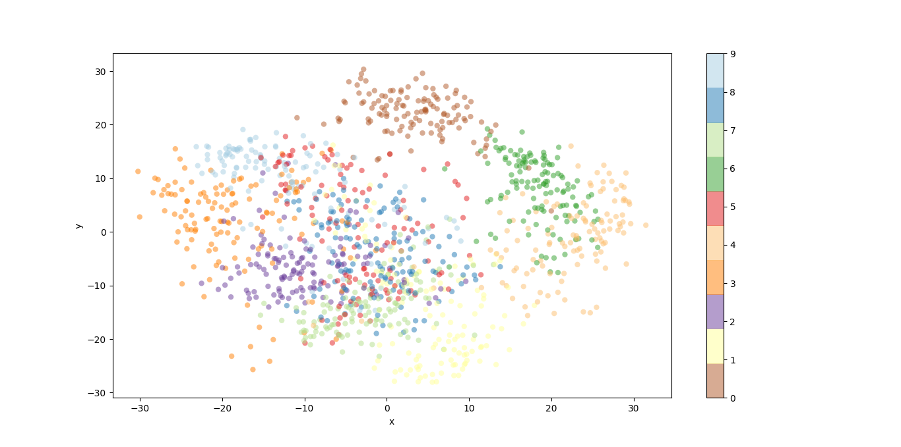
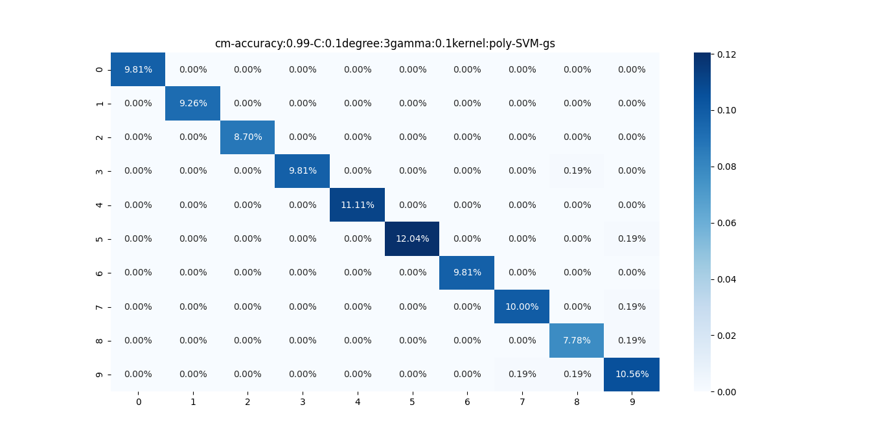
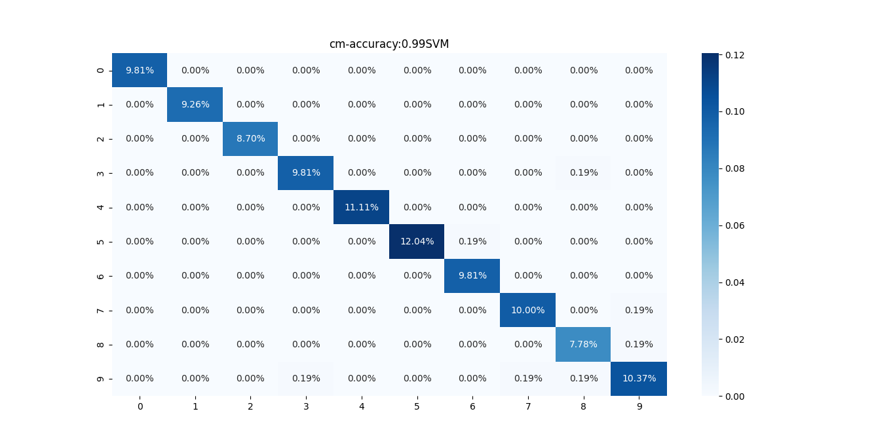

# Directory Structure
```text
.
├── api_test.py
├── app.py
├── docker-compose.yml
├── Dockerfile
├── figures
│   ├── Figure_cm-accuracy:0.99RandomForest-cv.png
│   └── Figure_iris.png
├── README.md
├── requirements.txt
├── run.py
├── utils
│   ├── data.py
│   ├── __init__.py
│   ├── model.py
│   └── plot.py
└── weights
    ├── RandomForest-cv-5dba7.pkl
    └── RandomForest-cv-b0mu6.pkl

3 directories, 15 files
```

# Command Line Interface
```text
usage: run.py [-h] [--gs GS] [--load LOAD]

optional arguments:
  -h, --help   show this help message and exit
  --gs GS      Find optimal parameters with 10-Fold GridSearchCV
  --load LOAD  True: Load trained model False: Train model default: False
```

# Exploration of the Handwritten Digits data

```text
Features: 64 Dimensional vector
```
```text
Labels: Digit labels
```

## Plot Handwritten digits with 2D PCA


# SVM Parameters
```text
gamma: 0.1, 1, 10, 100,
```
```text
C: 0.1, 1, 10, 100, 200
```
```text
degree: 2, 3, 4, 5, 6
```
```text
kernel: linear, rbf, poly
```
# Train the SVM model

## Experiment 1 - Run the 10Fold GridSearchCV

### Parameters
```text
gs: yes
```

### CLI

```shell
python run.py --gs yes
```

### Confusion Matrix


### Accuracy Score: 0.99

### Optimal Parameters with GridSearchCV

```text
gamma: 0.1
```
```text
C: 0.1
```
```text
degree: 3
```
```text
kernel: poly
```

## Experiment 2 - Run the Train-Test-Split

### Parameters
```text
gs: no
```

### CLI

```shell
python run.py --load no --gs no
```

### Confusion Matrix


### Accuracy Score: 0.99

## Experiment ... (not yet)

# Docker for the RandomForestClassifier  model

## Build the Docker image

You can build docker image by following:

```shell
docker-compose build
```

## Run Docker container

You can launch a container from the Docker image by following:

```shell
docker-compose up
```

